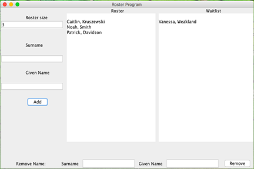

# Roster Program

Roster is a program that keeps track of students during a period of adding and dropping classes. 

The user interface consists of a column with roster size and name of student to be added. Student names are sorted into alphabetical order in the Roster, and first-in-first-out order in the Waitlist. At the beginning, students are added to the Roster, and when the roster reaches its given size, students are added to the waitlist. When removing a student name, the program searches and removes the name from whichever list it is in. 

## File Description

* LinkedListNode and LinkedList are interfaces that describe a node and a linked list of nodes.

* DoublyLinkedListNode and DoublyLinkedList are used to create a list of nodes, in which each node has a pointer towards
the next node, and a pointer towards the previous node. They contain methods to construct and modify doubly linked 
list node and list to be used for Roster class.

* Roster is a list of students being kept track during add/drop period. It is listed in alphabetically order and
has the size provided by the user. If more studenst than the determined size are added, the extras will show up in the waitlist, which does not have alphabetical order but the order of who is added first.

* RosterApplication has main method that creates a frame and calls RosterGUIController.

* RosterGUIController utilizes BorderLayout manager as an overall layout, creates the panels in the center, west, east
and bottom. The west and bottom panels use BoxLayout to hold JTextFields (to enter names) and JButtons (to modify lists). 
This class also implements an Action Listener, to detect and react to button click events. Specifically, it calls methods
in Roster and DoublyLinkedList to modify the lists when "Add" or "Remove" buttons are clicked. 

